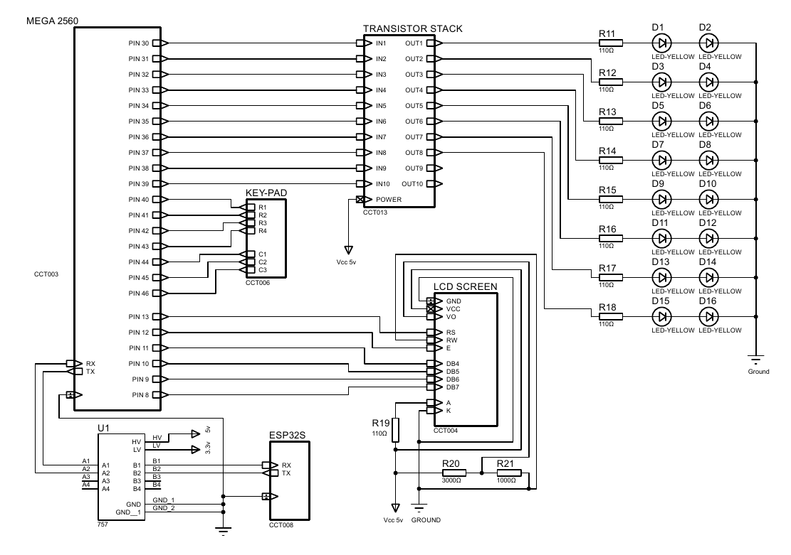
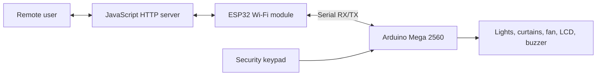

# Smart Home Appliances and Notification System

An Arduino Mega 2560 and ESP32-based smart-home prototype that combines remote device control, scheduled automation, environmental information, and keypad-based access control.

This project was developed as a team project for the EEE1002 Introduction to Electrics and Electronics Engineering course.



## Features

- Remote control through an HTTP-based server
- ESP32-to-server polling without blocking the main control loop
- Serial communication between the ESP32 and Arduino Mega 2560
- Remotely controlled lighting, curtains, and ceiling fan
- Automated day-night routines
- Hourly weather information displayed on an LCD
- Keypad-based access control

## System architecture



## Main hardware

- Arduino Mega 2560
- ESP32 Wi-Fi module
- 2N2222A transistor switching stages
- LED lighting outputs
- LCD screen
- Matrix keypad
- Motors and buzzer

## Repository structure

```text
assets/
  schematic-preview.png
docs/
  project-report.pdf
  schematics.pdf
  bill-of-materials.pdf
```

## Documentation

- [Project report](docs/project-report.pdf)
- [Circuit schematics](docs/schematics.pdf)
- [Bill of materials](docs/bill-of-materials.pdf)

## Archive status

This repository currently preserves the available report and hardware-design documentation. The original embedded and server source code is not included in this archive.

## Tools and technologies

- Arduino Mega 2560
- ESP32
- C++
- JavaScript
- HTTP
- Serial communication

## Author

Andaç Ünal
